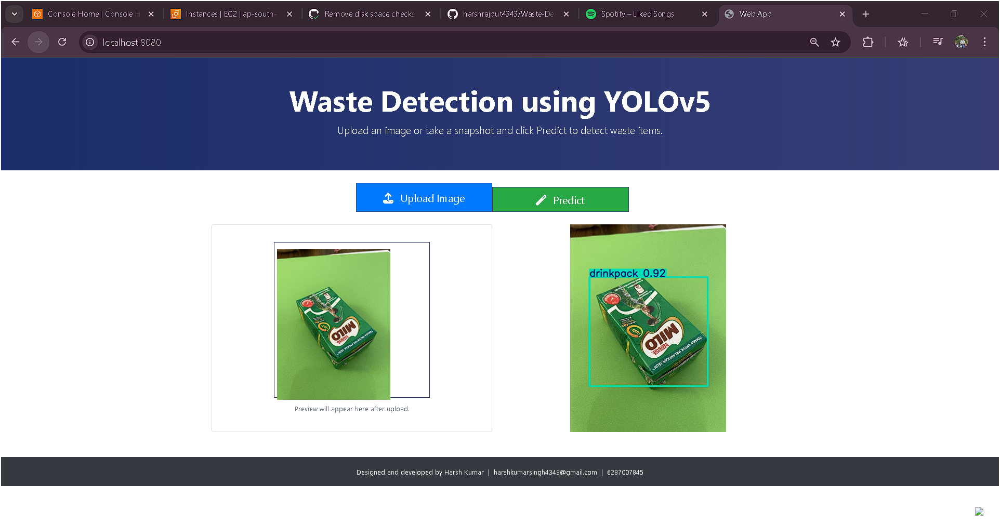
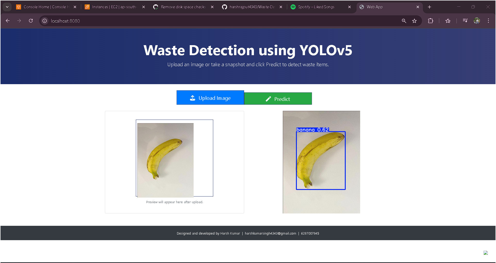
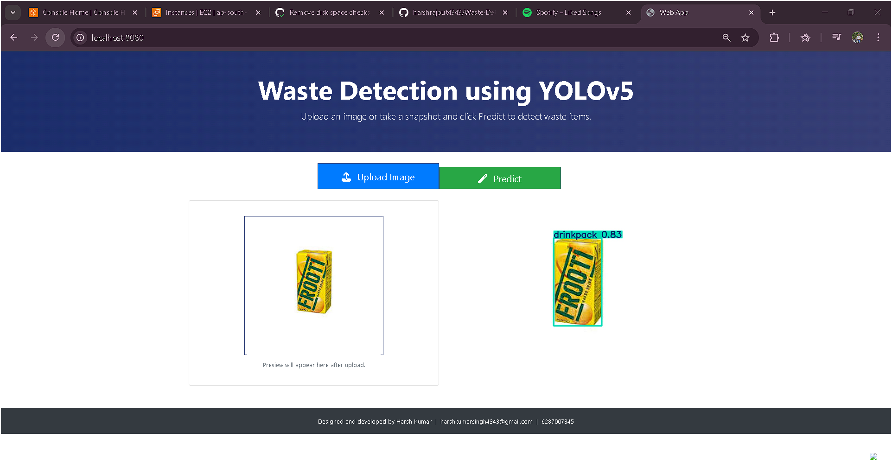

# Waste Detection Using YOLOv5

A complete end-to-end computer vision project for detecting waste items using YOLOv5 deep learning model with Flask web interface.

## 🎯 Demo

### Application Interface

*Detecting drink packages with high confidence*


*Detecting banana with 62% confidence*


*Detecting drink package with 92% confidence*

## 📋 Features

- Real-time waste detection using YOLOv5
- Web-based interface for easy image upload
- Supports multiple waste categories: bottles, cans, cups, fruit peels, etc.
- Confidence score display for each detection
- Docker support for easy deployment

## 🛠️ Workflow
## 🛠️ Workflow

1. Constants
2. Entity
3. Components
4. Pipelines
5. Flask Application (app.py)

## 🚀 How to Run?

### Prerequisites
- Python 3.10 or higher
- Conda (recommended)
- Docker (optional, for containerized deployment)

### STEP 01 - Clone the repository

```bash
git clone https://github.com/harshrajput4343/Waste-Detection-Using-yolo-v5
cd Waste-Detection-Using-yolo-v5
```

### STEP 02 - Create a conda environment

```bash
conda create -n wastedetection python=3.10.19 -y
conda activate wastedetection
```

### STEP 03 - Install the requirements

```bash
pip install -r requirements.txt
```

### STEP 04 - Run the application

```bash
python app.py
```

Visit `http://localhost:8080` in your browser to use the application.

## 🐳 Docker Deployment

Build the Docker image:

```bash
docker build -t harshrajput4343/waste .
```

Run the container:

```bash
docker run -p 8080:8080 harshrajput4343/waste
```

## 📦 AWS ECR Deployment

```bash
251941721464.dkr.ecr.ap-south-1.amazonaws.com/harsh/wastedetection
```

## 🎓 Model Information

- **Framework**: YOLOv5
- **Classes Detected**: banana-peel, bottle, can, cover, cup, juice-box, lemon-peel, orange-peel, straw
- **Confidence Threshold**: 0.25

## 👨‍💻 Author

**Harsh Kumar**
- Email: harshkumarsingh4343@gmail.com
- GitHub: [@harshrajput4343](https://github.com/harshrajput4343)
- ID: 6287007845

---

*Designed and developed w by Harsh Kumar*
